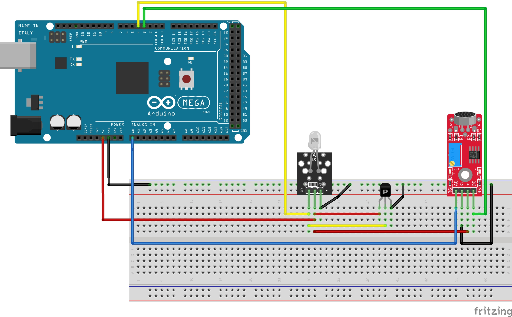

# PIXMOB WRISTBAND COLORS

## Introduction

This code lets you synchronize the colors of the Pixmob wristband (used in concerts by Coldplay, Taylor Swift, Karol G, and others) to the rhythm of music using Arduino and Elegoo components. There are two variants available (more details below)

- VERSION 1: Manual adjustment based on detected sound levels with as many colors as you like.

- VERSION 2: Random color selection when sensor detects any sound.

In both cases, you can customize the number of colors and choose the method that best suits your preferences.

Original idea inspired by: [Pixmob-music-rythm](https://github.com/drneox/pixmob-music-rhythm).

Color codes used, renamed, and updated from: [IR codes](https://github.com/danielweidman/flipper-pixmob-ir-codes).

## How it works


## Components and diagram

#### Components:
- Arduino Microcontroller
- KY-005 Infrared Transmitter module (more info [here](https://arduinomodules.info/ky-005-infrared-transmitter-sensor-module/))
- KY-037 Sensor module (more info [here](https://arduinomodules.info/ky-037-high-sensitivity-sound-detection-module/))
- NPN Transistor (in this case, CTBC547B)

#### Diagram



## Versions

#### Version 1:
**Manual adjustment based on detected sound levels:** Select different colors according to the sound level detected by the sensor. For example, you can set one color for silence, another for low volume, a different one for louder music, and so forth—with as many colors as you want.

File name: pixmob-music-colorsV1.ino


#### Version 2:
**Random color selection:** The sensor detects a sound, generates a random number, and displays the color corresponding to that number.

File name: pixmob-music-colorsV2.ino

#### Important
For the code to work correctly, if you only download one of the two versions or single files, you **must** also download the *libraries* folder and keep that exact name, since it contains essential files for managing the colors. Similarly, each `.ino` file must be inside its corresponding folder (although Arduino may create that folders when opening files). Your folder structure should look similar to this:

```
Arduino/
├── libraries/
│   ├── IRremote/
|   ├──  ...
|   └── Colors/
|
└── Pixmob_wristband/
    ├── pixmob_music_colorsV1/
    |    ├── pixmob-music-colorsV1.ino
    ├── pixmob_music_colorsV2/
    |    ├── pixmob-music-colorsV2.ino
    ├── README.md
    └──  ...
```

## How to change the colors
You will need the following files:
- The version of the code you are using (the `.ino` file).
- The `colors.h` file, located in `libraries` &rarr; `Colors` &rarr; `colors.h`. You can also see all color codes in `all_color_codes.txt` file.

Inside the `colors.h` file, you will see declarations like these:
```
...
extern uint16_t blue[27];
extern uint16_t cyan[27];
extern uint16_t little_blue[27];
extern uint16_t turqoise[25];
...
```
You only need the color name (e.g., `blue`, `cyan`, `little_blue`) and the number in brackets. In the `.ino` file, look for lines like:
```
irsend.sendRaw(red, 21, 38)
```
Change the color name (`red` in this example) and the first number (`21`here), for whatever you want from `colors.h` file. 

For example, to change `red` to `cyan`, replace this:

```
if (randomNumber == 1) {
    Serial.println("send red code");
    irsend.sendRaw(red, 21, 38);
}
```
For this:
```
if (randomNumber == 1) {
    Serial.println("send red code");
    irsend.sendRaw(cyan, 27, 38);
}
```
The last number (`38`) is the standard frequency to modulate the IR signal.

Currently, Version 1 uses 5 colors and Version 2 uses 6 colors, but you can add more, create a color for mute with an `else` clause, or customize however you like!

I hope this helps you revive your Pixmob wristband and brings back great memories! 😊 
